# Operation Intelligence 运维知识图谱系统设计文档

## 0. 文档控制信息

| 项目 | 内容 |
|------|------|
| 文档名称 | Operation Intelligence 运维知识图谱系统设计文档 |
| 文档编号 | OI-KG-SDD-001 |
| 适用范围 | `operation-intelligence` 运维知识图谱模块、`gateway` 兼容代理、`web-app` 图谱工作台、Agent 诊断接入 |
| 当前版本 | v1.4 |
| 文档状态 | 详细设计 |
| 基线日期 | 2026-05-11 |
| 目标读者 | 架构师、后端开发、前端开发、测试、运维、Agent 平台开发 |
| 相关文档 | `docs/architecture/overview.md`、`docs/architecture/api-boundaries.md`、`docs/architecture/operation-intelligence-knowledge-graph-design.md`、`docs/development/ui-guidelines.md`、`docs/deployment/from-scratch-to-running.md` |

## 0.1 版本控制与修订记录

| 版本 | 日期 | 作者 | 修订说明 |
|------|------|------|----------|
| v0.1 | 2026-05-11 | AI Assistant | 初稿，完成总体架构、前后台模块、图谱存储、迁移方案 |
| v1.0 | 2026-05-11 | AI Assistant | 补充业务流程、Mermaid 图表、接口规范、部署架构、DFX、测试设计和轻量迁移设计 |
| v1.1 | 2026-05-15 | AI Assistant | 去掉 NebulaGraph，改为 JSON 文件 + InMemoryGraphStore；更新架构图、时序图、存储设计、部署架构、测试范围 |
| v1.2 | 2026-05-18 | AI Assistant | 补充文件存储一致性、API 契约、安全边界、RDFS 导出边界、非功能指标和实体导入文件规范；系统资源迁移暂缓 |
| v1.3 | 2026-05-18 | AI Assistant | 明确 Schema DSL/YAML 与 JSON 的格式分工，默认导出改为原生 JSON/ZIP 包，RDFS 降级为可选扩展 |
| v1.4 | 2026-05-19 | AI Assistant | 简化本体变更流程，补充外部服务调用链导入与服务、集群、Pod、主机关联建模 |

## 0.2 文档目标

本文档给出运维知识图谱能力在 `operation-intelligence` 中的完整系统设计，覆盖以下目标：

- 在 `operation-intelligence` 中提供标准化、可扩展的运维知识图谱能力
- 采用轻量 YAML Schema DSL 作为本体定义和本体导出的主表达方式
- 使用 JSON 文件持久化 + InMemoryGraphStore 存储图谱实例数据，并支撑 JSON 导入、原生导出、图查询、影响分析、根因候选和 Agent 诊断语义接口
- 提供面向前台、网关代理、Agent、实体文件导入和运维的完整技术方案、部署方案和测试方案

## 1. 系统架构设计

### 1.1 设计原则

1. 领域收敛：图谱、本体、观测映射、诊断语义能力归属 `operation-intelligence`
2. 统一入口：浏览器和 SDK 仍以 `gateway` 为稳定入口
3. 轻量可扩展：本体定义采用 YAML Schema DSL，支持扩展不同业务系统实体、关系和属性
4. 格式分工：YAML 面向人工维护的 Schema DSL，JSON 面向实例导入、快照和原生导出；RDFS 仅作为未来可选扩展
5. 存算分离：本体定义和运行时实例存储解耦，本体由 Schema Registry 管理，实例落地 JSON 文件 + InMemoryGraphStore
6. 增量接入：本期优先支持文件导入、QoS 观测和第三方系统适配，`gateway` 系统资源迁移暂不纳入本期范围

### 1.2 整体架构图

业务场景说明：

- 浏览器经 `gateway` 访问图谱工作台和诊断能力
- `gateway` 代理图谱查询与管理接口，保持浏览器、SDK 和 Agent 的统一入口
- `operation-intelligence` 内部新增 `knowledge-graph` 子模块，包含本体、实例、映射、诊断语义四层
- 数据源可来自实体导入文件、QoS 观测、CMDB、K8s、第三方业务系统

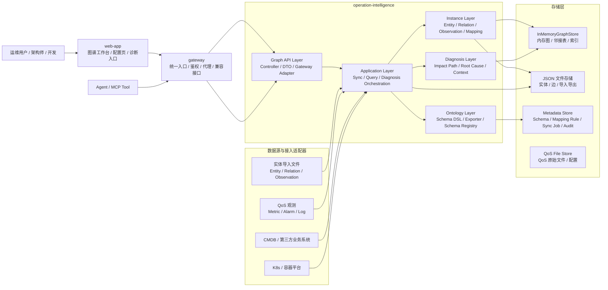

### 1.3 模块划分说明

#### 1.3.1 `web-app` 模块

职责：

- 图谱工作台页面
- 资源树浏览、子图探索、详情面板、影响路径、观测溯源、根因候选展示
- 图谱诊断入口和同步状态显示

边界：

- 不直接访问图存储内部结构
- 不直接理解 Schema DSL、RDFS/Turtle 或快照文件细节
- 只消费 `gateway` 暴露的稳定 API

#### 1.3.2 `gateway` 模块

职责：

- 稳定外部入口
- 用户上下文、鉴权、审计、限流
- 图谱查询代理
- 管理类接口权限控制与服务间鉴权透传

边界：

- 不再作为图谱本体 owner
- 不负责图谱推理或实例写入

#### 1.3.3 `operation-intelligence/qos`

职责：

- 指标、告警、日志等观测的采集与归一化
- 健康评分、贡献度、趋势计算
- 为知识图谱提供标准化观测输入

边界：

- 不直接承担图谱 schema 管理
- 不负责前台资源配置

#### 1.3.4 `operation-intelligence/knowledge-graph`

职责：

- 本体定义、Schema Registry、原生导出和可选标准格式导出
- 资源标准化、实体构建、关系构建
- 观测映射、实体状态更新、图查询、诊断语义

边界：

- 不承担浏览器侧鉴权职责
- 不依赖前端页面结构

### 1.4 技术选型说明

| 领域 | 技术选型 | 选择依据 |
|------|----------|----------|
| 后端框架 | Java 21 + Spring Boot | 与仓库现有服务栈一致，便于复用运行和配置体系 |
| API 风格 | REST + JSON | 与 `gateway` 和前端现有接口风格一致，便于代理和测试 |
| 图谱定义 | YAML Schema DSL | 轻量、易扩展、易维护、易与工程代码和前端元数据协同 |
| 原生导出 | ZIP/JSON Export Package | 同时导出 Schema DSL、本体版本、实体、关系和 Observation，支持备份、审计和再次导入 |
| 可选标准导出 | RDFS Exporter 扩展点 | 默认不实现；仅在需要对接 RDF/语义本体生态时启用 |
| 图存储 | JSON Snapshot + InMemoryGraphStore | 零外部依赖，与现有 `operation-intelligence` 架构一致；千级实体万级边内性能充分 |
| 元数据存储 | JSON/YAML 文件或轻量配置存储 | 与现有 `operation-intelligence` 配置管理模式兼容，适合 Schema 和映射规则 |
| 前端 | React + Vite | 与现有 `web-app` 一致 |
| 图谱展示 | ECharts Graph / 现有图谱组件模式 | 仓库已有 `RelationGraph` 实践，可快速落地并保持风格统一 |
| 调度 | Spring Scheduler | 与现有 QoS 采集调度模式一致 |
| 测试 | JUnit + Vitest + Playwright | 与现有仓库测试体系一致 |
| 观测 | 日志 + metrics + trace 兼容现有控制面 | 便于接入 `control-center`、Langfuse、Prometheus Exporter |

### 1.5 本体定义、实例存储与导出分层设计

业务场景说明：

- Schema DSL 使用 YAML，作为团队日常维护本体的唯一事实源
- 实例数据使用 JSON 导入和 JSON Snapshot 持久化，作为实体、关系、Observation 的唯一事实源
- 原生导出包默认使用 Schema DSL + JSON 实例文件 + manifest，支持再次导入
- RDFS 不参与在线读写闭环，仅保留为未来 `OntologyExporter` 扩展点

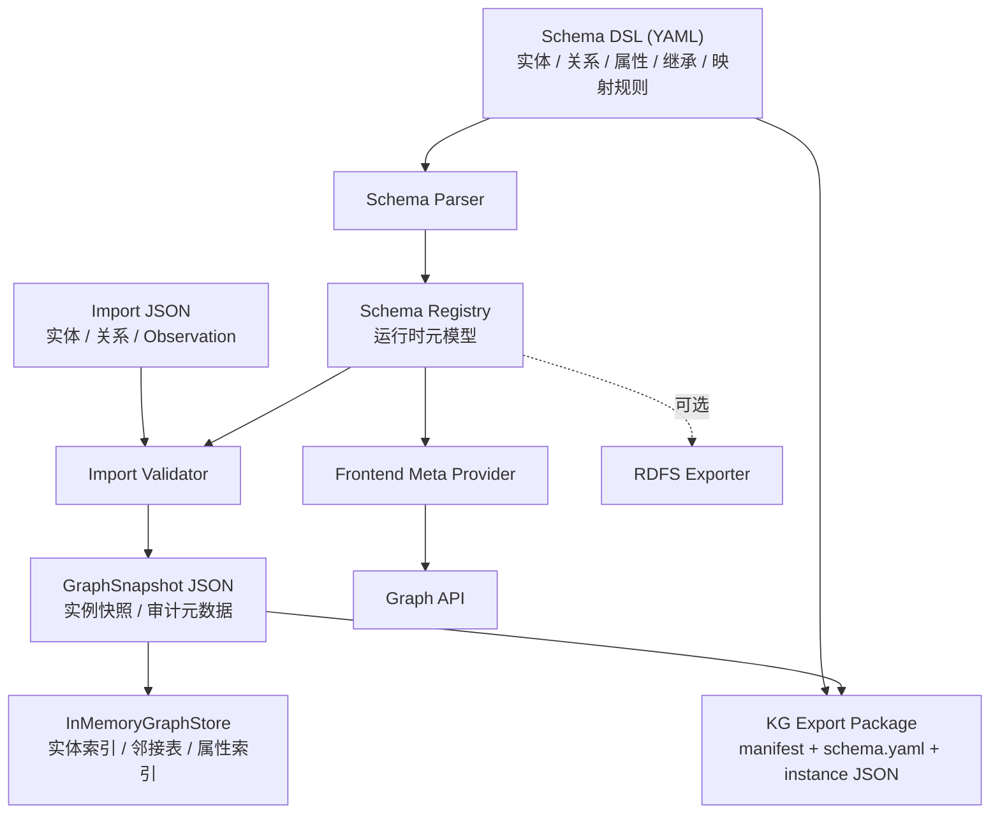

## 2. 业务流程设计

### 2.1 核心业务泳道图

业务场景说明：

- 新业务系统接入图谱时，需要经历资源建模、自动校验、同步、验证和前台可视化发布
- 泳道使用跨角色协同表达：业务域负责人、平台管理员、架构师、`operation-intelligence`、`gateway`

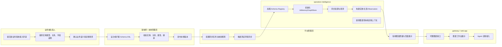

### 2.2 关键业务流程图：Schema 轻量发布流

业务场景说明：

- Schema DSL 由模块 owner 维护，不设置独立审批系统
- 变更以“本地修改 -> 自动校验 -> 样例导入 -> 发布版本”为主，复杂破坏性变更再走人工评审

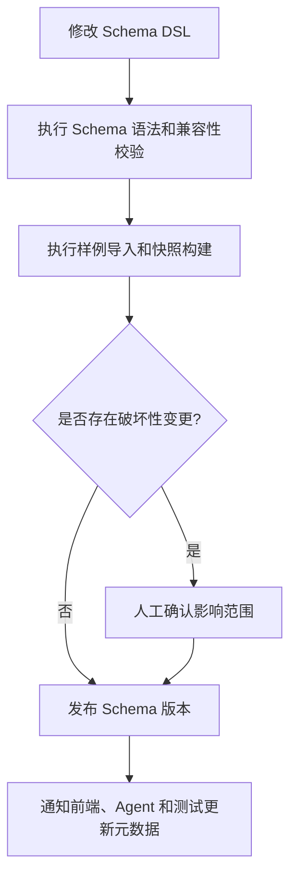

### 2.3 关键业务流程图：实体与观测入图数据流转

业务场景说明：

- 该流程描述实体导入文件与 QoS 观测同时进入图谱的主链路

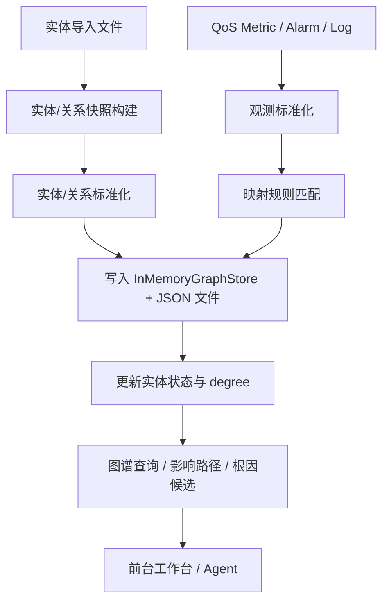

### 2.4 异常处理流程图

业务场景说明：

- 描述同步、schema 编译、图写入失败时的处理闭环

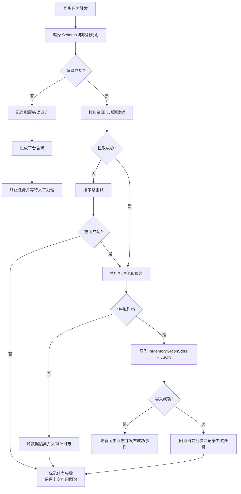

## 3. 技术实现方案

### 3.1 系统时序图：图谱子图查询

业务场景说明：

- 用户在前台点击某个实体节点，系统返回 1~2 跳子图、实体详情和观测摘要

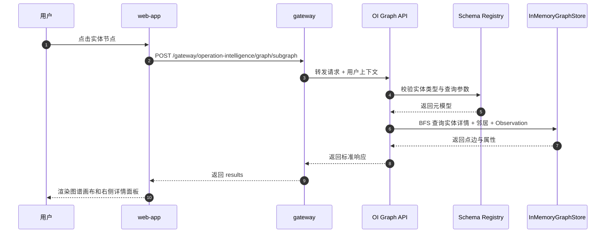

### 3.2 数据流图：从输入到输出的完整路径

业务场景说明：

- 该图展示从多源输入到图谱查询输出的完整技术路径

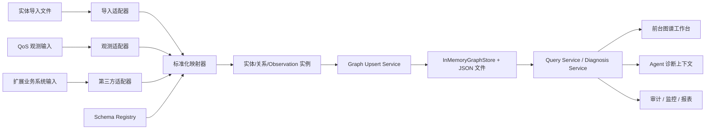

### 3.3 状态图：同步任务状态变化

业务场景说明：

- 同步任务对象是平台运维的核心对象，需要明确状态变化与异常处理

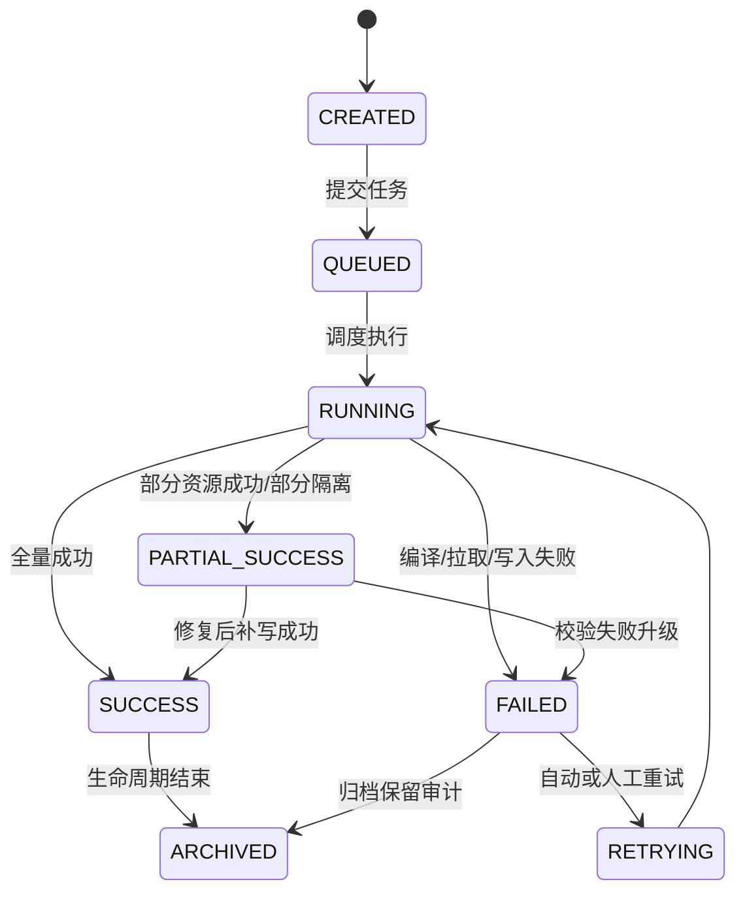

## 4. 接口设计规范

### 4.1 API 设计原则

1. 前端默认走 `gateway` 代理路径
2. 响应结构与现有平台保持一致，优先 `success + result/results`
3. 所有写接口需带审计信息
4. 查询接口必须支持 `envCode`
5. 诊断相关接口应支持 `entityId`、`timeRange` 和 `includeObservations`

### 4.2 API 时序图：前后端交互流程

业务场景说明：

- 用户在图谱工作台中查询根因候选

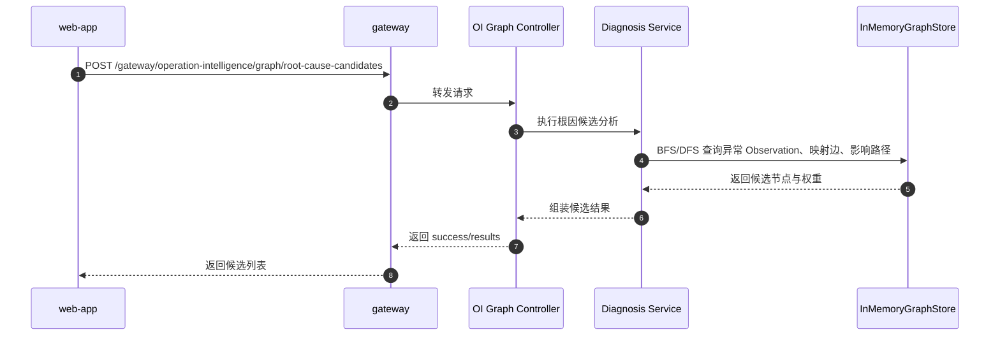

### 4.3 关键接口清单

| 接口 | 方法 | 说明 |
|------|------|------|
| `/gateway/operation-intelligence/graph/resources/tree` | GET | 查询资源树 |
| `/gateway/operation-intelligence/graph/subgraph` | POST | 查询实体子图 |
| `/gateway/operation-intelligence/graph/entities/{entityId}` | GET | 查询实体详情 |
| `/gateway/operation-intelligence/graph/observations/query` | POST | 查询观测溯源 |
| `/gateway/operation-intelligence/graph/impact-path` | POST | 查询影响路径 |
| `/gateway/operation-intelligence/graph/root-cause-candidates` | POST | 查询根因候选 |
| `/gateway/operation-intelligence/graph/diagnosis/context` | POST | 获取 Agent 诊断上下文 |
| `/gateway/operation-intelligence/graph/admin/sync/full` | POST | 触发全量同步 |
| `/gateway/operation-intelligence/graph/admin/sync/incremental` | POST | 触发增量同步 |
| `/gateway/operation-intelligence/graph/admin/jobs/{jobId}` | GET | 查询同步作业状态 |
| `/gateway/operation-intelligence/graph/admin/import` | POST | 导入实体、关系和观测 JSON 文件 |
| `/gateway/operation-intelligence/graph/admin/export` | POST | 导出本体和实例原生数据包 |

### 4.4 API 契约约束

通用请求约束：

- 所有图谱查询请求必须包含 `envCode`。没有环境维度的离线导入数据统一使用 `default`，不得省略。
- 查询接口默认 `includeObservations=false`，只有详情、诊断和观测溯源场景按需开启。
- `timeRange` 在诊断、观测、根因候选接口中必填，格式使用 ISO-8601 时间字符串，前端传入本地时间前必须转换为带时区的绝对时间。
- `maxHops` 默认 3，最大 6；超过最大值直接返回参数错误。
- 子图接口必须支持 `nodeLimit` 和 `edgeLimit`，默认分别为 100 和 1000，最大分别为 500 和 2000；结果被裁剪时返回 `truncated=true` 和 `truncateReason`。
- 列表型接口必须支持分页或游标，禁止一次返回全量实体、全量关系或全量 Observation。

通用响应结构：

```json
{
  "success": true,
  "result": {},
  "error": null,
  "requestId": "req-20260518-0001"
}
```

批量查询或列表查询使用 `results`：

```json
{
  "success": true,
  "results": [],
  "page": {
    "cursor": "next-cursor",
    "hasMore": true
  },
  "requestId": "req-20260518-0002"
}
```

错误响应要求：

- 参数错误返回稳定错误码，如 `INVALID_ENV_CODE`、`INVALID_TIME_RANGE`、`GRAPH_QUERY_LIMIT_EXCEEDED`。
- 业务对象不存在返回 `ENTITY_NOT_FOUND`、`SCHEMA_VERSION_NOT_FOUND`。
- 权限不足返回 `FORBIDDEN_GRAPH_ADMIN` 或 `FORBIDDEN_DEBUG_INFO`，不得把内部异常堆栈或文件路径返回给前端。
- `debugInfo` 只允许管理员开启，且不得包含密钥、文件绝对路径、第三方 token 或原始认证头。

### 4.5 数据库 ER 图

业务场景说明：

- 虽然图实例落在 InMemoryGraphStore，但系统仍需要一套元数据和作业控制模型
- 下图展示逻辑元数据表结构，可由 JSON/轻量配置存储或后续关系库存储承载

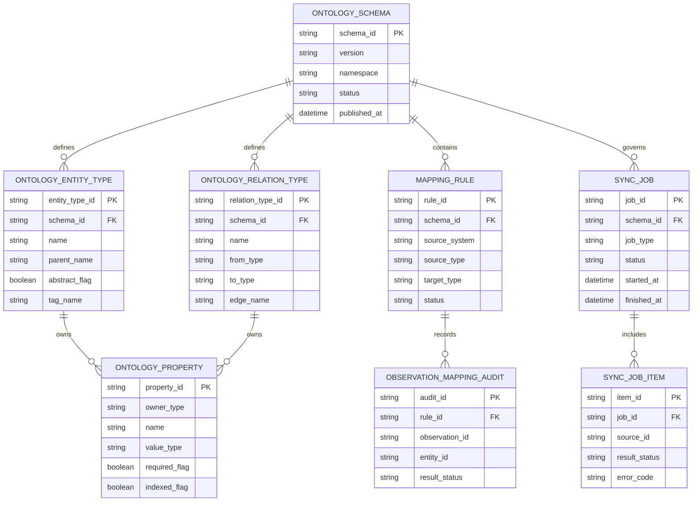

### 4.6 微服务调用链图

业务场景说明：

- 展示前端、网关、图谱服务、QoS 与存储的典型调用路径

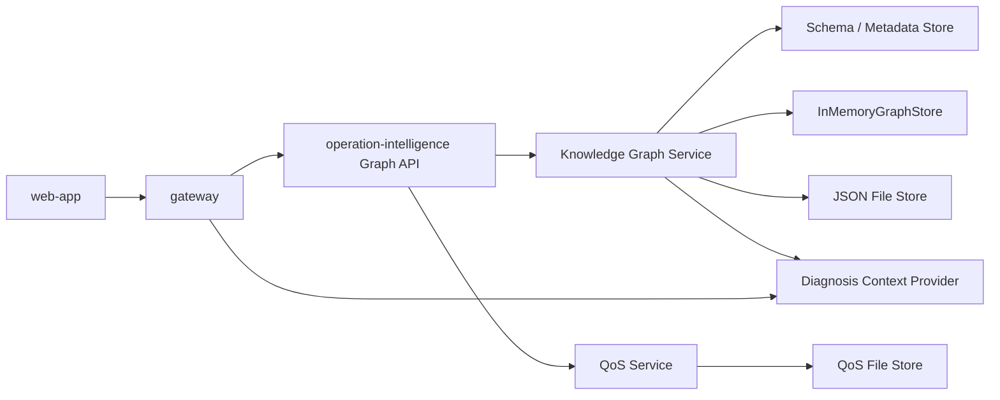

## 5. 前台页面功能设计

### 5.1 设计依据

前台设计遵循 `docs/development/ui-guidelines.md`，重点复用以下模式：

- route-driven shell
- section card
- list/detail
- right-panel inspection
- top toolbar + result workbench

### 5.2 页面结构设计

#### 5.2.1 图谱工作台页面

页面定位：

- 作为 `operation-intelligence` 模块下的图谱浏览和诊断工作台

建议路由：

- `/#/operation-intelligence/graph`

页面布局：

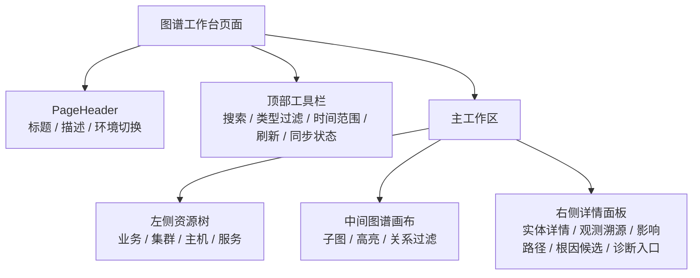

#### 5.2.2 核心功能点

| 区域 | 功能 |
|------|------|
| 顶部工具栏 | 环境切换、关键字检索、类型过滤、同步状态、手工刷新 |
| 左侧资源树 | 展示标准化资源树，支持按业务、集群、主机和服务浏览 |
| 中间图谱画布 | 展示实体关系图，支持缩放、定位、高亮异常节点 |
| 右侧详情面板 | 展示实体属性、来源、观测、影响路径、根因候选 |
| 诊断入口 | 将当前实体上下文发送给 Agent |

### 5.3 前台交互流程

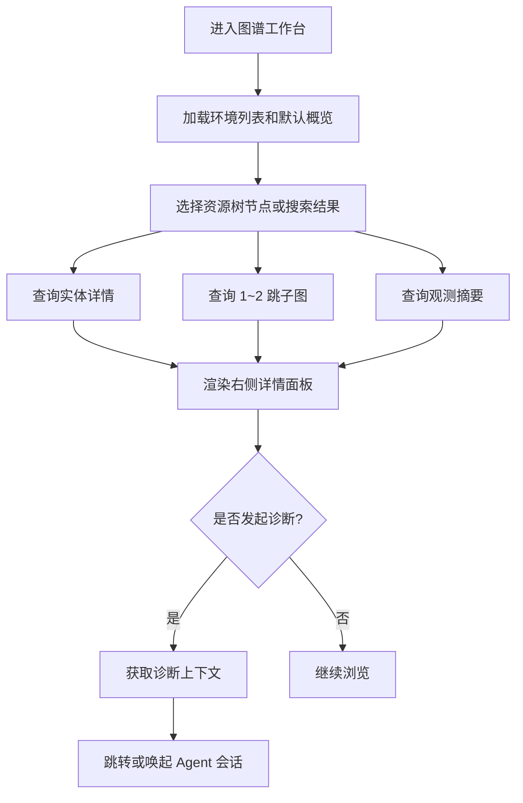

### 5.4 页面风格说明

1. 保持当前平台壳层和侧边栏导航
2. 图谱页采用 workbench 模式，输入和筛选置于顶部
3. 详情查看优先使用右侧面板，窄屏降级为弹窗
4. 所有用户文案进入 i18n
5. 图谱状态色沿用既有 `success/warning/danger/neutral/info` 语义，不引入新色系

## 6. 部署架构文档

### 6.1 网络拓扑图

业务场景说明：

- 展示图谱相关服务在开发/测试/生产中的典型部署关系

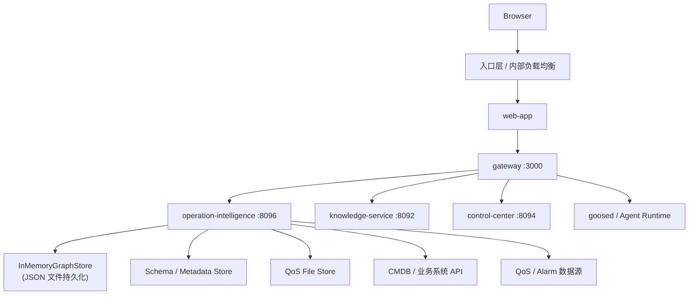

### 6.2 CI/CD 流程图

业务场景说明：

- 用于指导图谱模块、前端、网关代理和文档变更的持续交付流程

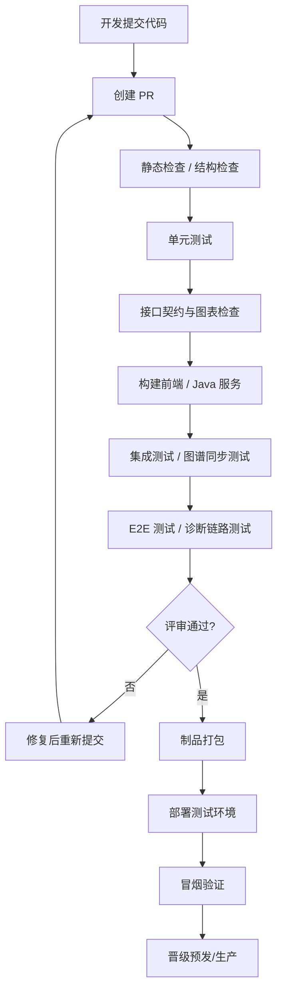

### 6.3 容灾备份架构图

业务场景说明：

- 展示图谱实例、元数据和文件产物的备份策略

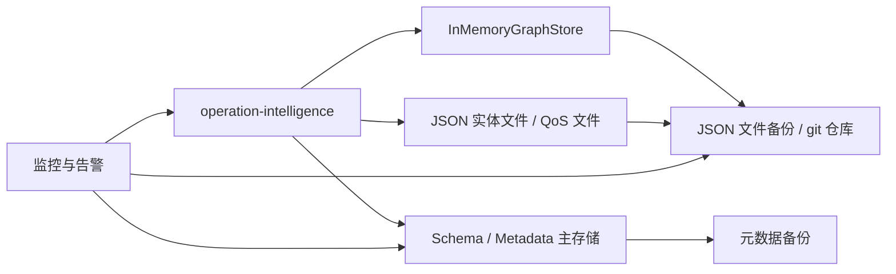

### 6.4 部署说明

1. `gateway` 仍是浏览器和 Agent 的稳定入口
2. `operation-intelligence` 新增图谱模块后端口不变，内部扩展 API，无额外外部依赖
3. 图谱数据以 JSON 文件持久化，与现有 QoS 文件存储模式一致，可通过 git 或文件备份实现容灾
4. InMemoryGraphStore 在应用启动时从 JSON 文件加载，无需独立的图数据库进程

### 6.5 JSON 文件一致性与恢复策略

为避免“内存图写入成功但文件落盘失败”或“文件部分写入导致启动失败”，图谱实例数据采用快照化写入模型：

1. 单写者原则：同一 `envCode` 同一时间只允许一个导入、同步或重建任务写入图谱快照；并发任务进入队列或返回 `GRAPH_WRITE_CONFLICT`。
2. 构建临时图：写入流程先在独立的临时 `GraphSnapshot` 中完成 Schema 校验、实体去重、关系端点校验、Observation 映射校验和索引构建。
3. 原子落盘：校验通过后写入 `*.tmp` 文件，完成 flush 后再原子 rename 为正式快照文件；正式文件只保存完整可加载的版本。
4. 内存切换：正式快照落盘成功后，通过引用替换将 `InMemoryGraphStore` 切换到新快照；查询线程始终读取某个完整快照，不读取半成品。
5. 失败回滚：临时图构建、文件写入或切换任一阶段失败时，保留上一次成功快照，任务状态标记为 `FAILED` 或 `PARTIAL_SUCCESS`。
6. 启动恢复：启动时优先加载最新 `SUCCESS` 快照；若最新快照损坏，自动回退到上一个成功快照并记录告警；不得尝试从损坏文件中半量恢复在线图。
7. 版本留存：每个 `envCode` 至少保留最近 3 个成功快照，支持人工回退；超过保留窗口的历史快照按配置清理。
8. 审计记录：每次快照切换记录 `snapshotId`、`schemaVersion`、`sourceSystem`、实体数、关系数、Observation 数、操作者和任务 ID。

## 7. DFX 设计

### 7.1 可设计性（Design for Extensibility）

- Schema DSL 支持扩展实体、关系、属性、继承和命名空间
- 新业务系统接入以“新增 Adapter + Mapping Rule + Schema 扩展”为主，不改核心引擎
- 前台页面由元数据驱动字段展示和部分表单配置

### 7.2 可测试性（Design for Testability）

- Schema Parser、InMemoryGraphStore、Mapping Rule Evaluator 可独立单测
- 同步任务支持 dry-run 模式
- 查询接口与内存图实现解耦，便于仓储级 mock 或集成测试

### 7.3 可观测性（Design for Observability）

- 所有同步任务具备 `jobId`
- 核心日志带 `envCode`、`schemaVersion`、`sourceSystem`、`jobId`
- 暴露同步成功率、映射命中率、图写入耗时、查询耗时等 metrics

### 7.4 可诊断性（Design for Diagnosability）

- 观测映射和根因候选结果保留审计链路
- 失败数据进入隔离区，便于回放
- 查询接口支持返回 `debugInfo` 开关，仅管理员可用
- `debugInfo` 必须脱敏，不返回认证头、密钥、文件绝对路径、第三方 token 和原始异常堆栈

### 7.5 可运维性（Design for Serviceability）

- 支持 schema 重建、同步重试、查询热修复、批次回滚
- 提供控制面查看最近同步任务和失败原因
- 关键配置集中在 `config.yaml` 和 Schema DSL 文件

### 7.6 安全设计（Design for Security）

- 浏览器不直接访问图数据库
- 所有管理操作通过 `gateway` 入口鉴权，`gateway` 负责透传 `x-user-id`、`x-request-id` 和服务间 `x-secret-key`
- 管理类接口仅管理员角色可调用，普通运维用户只能执行查询和诊断上下文获取
- `operation-intelligence` 直连端口只接受服务间密钥认证，不作为浏览器或 SDK 的公开入口
- 图谱实体属性支持敏感字段标记，返回前按角色执行脱敏
- 同步和导入操作记录审计日志
- 敏感配置通过现有配置覆盖机制管理，不写死在前端

## 8. 测试设计

### 8.1 测试范围

| 测试类型 | 范围 |
|----------|------|
| 单元测试 | Schema 解析、元模型校验、映射规则、状态计算、InMemoryGraphStore BFS/DFS |
| 集成测试 | 实体导入、QoS 观测映射、图查询接口、网关代理、JSON 文件快照读写 |
| 端到端测试 | 前台图谱工作台浏览、诊断入口联动、同步任务可视化 |
| 性能测试 | 子图查询、影响路径查询、根因候选分析 |
| 回归测试 | 兼容 Agent 诊断链路和既有 `operation-intelligence` QoS 能力 |

### 8.2 测试分层设计

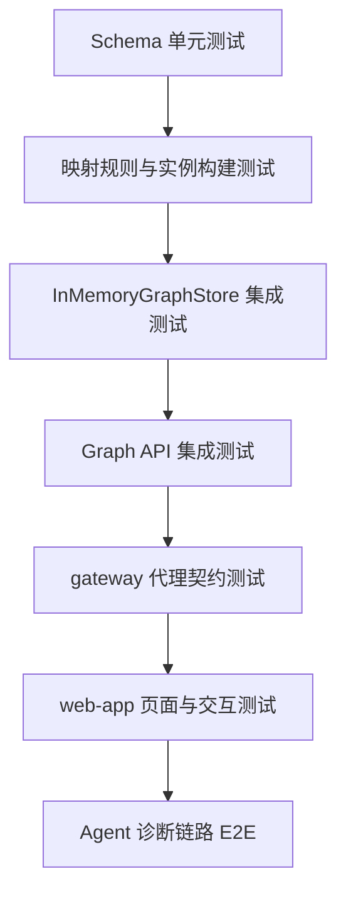

### 8.3 重点测试用例

1. 新增实体类型后，Schema Registry 能正确加载继承关系
2. Schema DSL 能正确编译为 Schema Registry 元模型，并能随原生导出包导出
3. 具体实体类型能正确初始化 InMemoryGraphStore 索引结构
4. 实体导入文件处理后，图谱实例数量和关系数量符合预期
5. Observation 能正确映射到目标实体，并更新状态和 degree
6. 子图查询支持不同 hops 和关系过滤
7. 根因候选接口能输出排序稳定的候选结果
8. 前台页面可在中英文下正确显示
9. JSON 文件快照写入失败时，服务仍保留上一次成功图谱

## 9. 系统资源迁移暂缓说明

### 9.1 范围说明

`gateway` 中已定义的系统资源迁移暂不纳入本期建设范围。本期优先完成：

- Schema DSL 与 Schema Registry
- 实体、关系、Observation 的标准导入文件规范
- 本体和实体的原生导出包规范
- JSON 文件快照 + InMemoryGraphStore
- 图查询、影响路径、根因候选和 Agent 诊断上下文接口
- 前台图谱工作台只读浏览和诊断入口

### 9.2 后续迁移前置条件

后续重新启动系统资源迁移前，必须先补充独立迁移设计，至少覆盖：

- 旧资源 ID 到新 `entityId` 的稳定映射规则
- 旧接口响应与新图谱实体模型的兼容契约
- 迁移期单写或双写策略、冲突处理和回滚方案
- 历史数据校验、差异报告和验收指标
- Agent 旧工具调用到图谱诊断上下文的兼容路径

## 10. 核心对象与数据模型设计

### 10.1 实体层表达方式

设计原则：

- 本体定义和本体导出主表达使用 YAML Schema DSL
- 实体、关系、Observation 的导入、快照和导出主表达使用 JSON
- 运行时通过 Schema Registry 加载
- InMemoryGraphStore 只存实例

格式分工：

- Schema DSL 是本体唯一事实源，适合人工维护、评审、注释和版本控制。
- GraphSnapshot JSON 是实例唯一事实源，适合批量导入、原子快照、分页导出和程序处理。
- KG Export Package 是默认导出形式，用于备份、审计、跨环境迁移和再次导入。
- RDFS/Turtle 默认不实现，仅作为 `OntologyExporter` 扩展点；当明确需要语义网或 RDF 生态对接时再建设。

### 10.2 Schema DSL 示例

```yaml
version: 1.0
namespace: itom

entityTypes:
  - name: Entity
    abstract: true
    properties:
      - name: status
        type: string
        enum: [Normal, Slow, Failed, Unknown]
      - name: degree
        type: double

  - name: Cluster
    extends: Entity
    tagName: Cluster
    properties:
      - name: clusterName
        type: string
        required: true
        indexed: true
      - name: clusterType
        type: string

  - name: BusinessCapability
    extends: Entity
    tagName: BusinessCapability
    properties:
      - name: menuId
        type: string
        required: true
        indexed: true
      - name: menuName
        type: string
        required: true

  - name: ApiEndpoint
    extends: Entity
    tagName: ApiEndpoint
    properties:
      - name: url
        type: string
        required: true
        indexed: true
      - name: method
        type: string

  - name: Service
    extends: Entity
    tagName: Service
    properties:
      - name: serviceName
        type: string
        required: true
        indexed: true
      - name: serviceCode
        type: string
        indexed: true

  - name: ServiceOperation
    extends: Entity
    tagName: ServiceOperation
    properties:
      - name: operationName
        type: string
        required: true
        indexed: true
      - name: serviceName
        type: string
        required: true
        indexed: true

  - name: Pod
    extends: Entity
    tagName: Pod
    properties:
      - name: podName
        type: string
        required: true
        indexed: true
      - name: namespace
        type: string

  - name: Host
    extends: Entity
    tagName: Host
    properties:
      - name: hostname
        type: string
      - name: ip
        type: string
        required: true
        indexed: true

relationTypes:
  - name: endpoint_of
    edgeName: endpoint_of
    from: ApiEndpoint
    to: BusinessCapability
    properties:
      - name: flowId
        type: string
      - name: seqNo
        type: string

  - name: operation_of
    edgeName: operation_of
    from: ServiceOperation
    to: Service

  - name: invokes_operation
    edgeName: invokes_operation
    from: ApiEndpoint
    to: ServiceOperation
    properties:
      - name: flowId
        type: string
      - name: parentSeqNo
        type: string
      - name: childSeqNo
        type: string
      - name: callCount
        type: long
      - name: successCount
        type: long
      - name: successRate
        type: double
      - name: avgCostMs
        type: double
      - name: minCostMs
        type: double
      - name: maxCostMs
        type: double

  - name: operation_calls
    edgeName: operation_calls
    from: ServiceOperation
    to: ServiceOperation
    properties:
      - name: flowId
        type: string
      - name: parentSeqNo
        type: string
      - name: childSeqNo
        type: string
      - name: callCount
        type: long
      - name: successCount
        type: long
      - name: successRate
        type: double
      - name: avgCostMs
        type: double
      - name: minCostMs
        type: double
      - name: maxCostMs
        type: double

  - name: hosted_in
    edgeName: hosted_in
    from: Host
    to: Cluster
    properties:
      - name: weight
        type: double

  - name: deployed_in
    edgeName: deployed_in
    from: Service
    to: Cluster

  - name: deployed_on
    edgeName: deployed_on
    from: Service
    to: Host
    properties:
      - name: callCount
        type: long
      - name: successCount
        type: long
      - name: successRate
        type: double

  - name: runs_on
    edgeName: runs_on
    from: Pod
    to: Host

  - name: serves
    edgeName: serves
    from: Pod
    to: Service

  - name: calls
    edgeName: calls
    from: Service
    to: Service
    properties:
      - name: callCount
        type: long
      - name: successRate
        type: double
      - name: latencyMsP95
        type: double
      - name: avgCostMs
        type: double
      - name: minCostMs
        type: double
      - name: maxCostMs
        type: double
```

### 10.3 InMemoryGraphStore 实例设计原则

1. 抽象父类只在 Schema 层存在，不直接建内存结构
2. 具体实体类型各自维护属性集合
3. 公共属性在编译期下沉到具体实体
4. 核心属性建内存索引，长尾属性按需查找

### 10.4 微服务与存储映射图

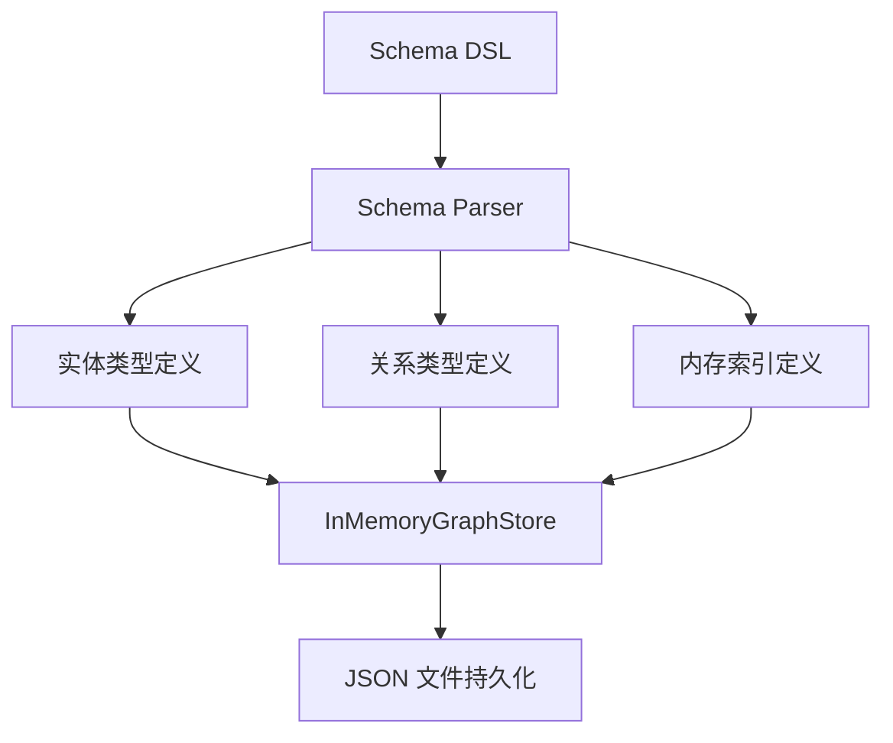

### 10.5 服务调用链与部署关系建模

业务调用链、主机、集群、Pod 和服务部署关系统一进入同一张运维知识图谱，但来源和更新节奏不同：

- 服务调用链由外部挖掘系统生成，通常包含业务菜单、查询时间窗口、flow 级统计、按 `seqNo` 排列的 URL 或服务操作节点、节点所在集群、节点 IP 列表、调用次数、成功率和耗时指标。
- 主机、集群、Pod、服务部署关系可来自 CMDB、K8s 或调用链导入文件中的补充字段。
- 调用链导入时允许同时 upsert 业务能力、入口 API、服务、服务操作、服务调用关系、服务所在集群关系，以及可识别的 Pod/主机关联关系。
- 外部调用链只作为事实来源之一，不直接覆盖更权威来源的实体基础属性；当同一属性来自多个来源时，按 `sourcePriority` 或配置的来源优先级合并。

推荐实体与关系：

| 对象 | 类型 | 说明 |
|------|------|------|
| 业务能力 | `BusinessCapability` | 调用链所属业务入口，例如样例中的 `menuId=604015020`、`menuName=B2B业务` |
| 入口 API | `ApiEndpoint` | URL 入口节点，例如 `/common/v1/sysparam/querysysparams` |
| 服务 | `Service` | 业务服务或微服务，稳定主键优先使用服务编码、命名空间和环境组合 |
| 服务操作 | `ServiceOperation` | 服务上的具体操作，例如 `bes.business.common.SysParamBS.querySysParams` |
| 集群 | `Cluster` | 服务部署所在集群，可由调用链补充或由 CMDB/K8s 提供 |
| Pod | `Pod` | K8s Pod 实例，可选；调用链只有服务粒度时可以不导入 |
| 主机 | `Host` | 物理机或虚拟机；样例中的 IP 列表可转换为主机实体 |
| 服务调用 | `calls` | `Service -> Service`，承载调用次数、成功率、时延等窗口指标 |
| 操作调用 | `operation_calls` | `ServiceOperation -> ServiceOperation`，保留 flow 内 `seqNo` 父子调用层级 |
| 入口调用操作 | `invokes_operation` | `ApiEndpoint -> ServiceOperation`，保留 URL 入口到服务操作的调用 |
| 服务部署集群 | `deployed_in` | `Service -> Cluster`，表示服务当前部署或归属集群 |
| 服务部署主机 | `deployed_on` | `Service -> Host`，当调用链只有 IP 没有 Pod 时，表示服务观测到的承载主机 |
| Pod 承载服务 | `serves` | `Pod -> Service`，表示 Pod 提供某服务能力 |
| Pod 运行主机 | `runs_on` | `Pod -> Host`，表示 Pod 所在主机 |

调用链导入处理规则：

1. 先解析调用链批次的业务上下文，按 `envCode + menuId` upsert `BusinessCapability`。
2. 对每个 flow 的节点按 `seqNo` 建立调用层级：`1` 的子节点可以是 `1.1`，`1.1` 的子节点可以是 `1.1.1`、`1.1.2` 等。
3. 仅包含 `url` 的节点 upsert 为 `ApiEndpoint`；包含 `serviceName + operationName` 的节点 upsert 为 `ServiceOperation`，同时 upsert 所属 `Service` 并建立 `operation_of`。
4. URL 节点与业务能力建立 `endpoint_of`；URL 节点调用服务操作时建立 `invokes_operation`。
5. 服务操作之间按 `seqNo` 父子关系建立 `operation_calls`；同时派生服务级 `calls` 关系，便于影响分析和根因候选。
6. 如节点包含 `cluster`，upsert `Cluster`，并为节点对应的 `Service` 建立 `Service -> Cluster` 的 `deployed_in` 关系。
7. 如节点包含 IP 列表，upsert `Host`，并在没有 Pod 信息时为服务建立 `Service -> Host` 的 `deployed_on` 关系；如后续补充 Pod 信息，再建立 `Pod -> Service` 和 `Pod -> Host`。
8. flow 级和节点级的 `callCount`、`successCount`、`successPercent`、`avgCost`、`minCost`、`maxCost` 写入关系属性和 Observation；指标窗口必须来自调用链批次的 `queryTimeRange`。
9. 调用链导入为增量 upsert，不删除本次文件未出现的服务和关系；关系过期清理由独立保留策略处理。
10. 调用链来源的实体属性应带 `source.system`、`source.externalId` 和原始 `flowId`/`seqNo`，便于审计、去重和回放。

## 11. 实体导入文件规范

### 11.1 文件格式

实体导入文件使用 UTF-8 编码的 JSON 文件，单文件包含一个环境和一次导入批次的数据。文件扩展名建议为 `.graph-import.json`。

顶层结构：

```json
{
  "formatVersion": "1.0",
  "envCode": "prod",
  "schemaVersion": "1.0",
  "sourceSystem": "manual-import",
  "importMode": "UPSERT",
  "snapshotId": "kg-prod-20260518-001",
  "generatedAt": "2026-05-18T10:00:00+08:00",
  "metadata": {},
  "entities": [],
  "relations": [],
  "observations": []
}
```

字段说明：

| 字段 | 必填 | 说明 |
|------|------|------|
| `formatVersion` | 是 | 导入文件格式版本，当前为 `1.0` |
| `envCode` | 是 | 环境编码，必须与查询接口使用的 `envCode` 一致 |
| `schemaVersion` | 是 | 目标 Schema DSL 版本 |
| `sourceSystem` | 是 | 数据来源，如 `manual-import`、`cmdb`、`k8s`、`service-call-mining` |
| `importMode` | 是 | `UPSERT` 或 `REPLACE_ENV`；`REPLACE_ENV` 会替换该环境完整快照 |
| `snapshotId` | 否 | 外部指定的快照 ID；为空时由系统生成 |
| `generatedAt` | 是 | 文件生成时间，使用 ISO-8601 带时区格式 |
| `metadata` | 否 | 导入批次元信息，如查询时间范围、flow 总数、来源批次号 |
| `entities` | 是 | 实体列表，可为空数组 |
| `relations` | 是 | 关系列表，可为空数组 |
| `observations` | 否 | 观测列表，可为空数组 |

### 11.2 实体格式

```json
{
  "id": "host-001",
  "type": "Host",
  "name": "app-server-01",
  "displayName": "应用服务器 01",
  "status": "Normal",
  "labels": ["app", "linux"],
  "properties": {
    "hostname": "app-server-01",
    "ip": "10.10.1.11"
  },
  "source": {
    "system": "manual-import",
    "externalId": "cmdb-host-001"
  }
}
```

实体约束：

- `id` 在同一 `envCode` 内必须全局唯一，建议使用稳定业务 ID，不使用导入时随机 ID。
- `type` 必须存在于目标 Schema Registry，且不能是抽象实体类型。
- `properties` 必须满足 Schema DSL 中的必填字段、类型、枚举和敏感字段约束。
- `status` 默认 `Unknown`，允许值由 Schema DSL 的公共属性定义。
- `source.externalId` 用于审计和幂等导入，不参与前端展示主键。

### 11.3 关系格式

```json
{
  "id": "rel-host-001-hosted-in-cluster-001",
  "type": "hosted_in",
  "from": "host-001",
  "to": "cluster-001",
  "properties": {
    "weight": 1.0
  },
  "source": {
    "system": "manual-import",
    "externalId": "cmdb-rel-001"
  }
}
```

关系约束：

- `id` 在同一 `envCode` 内必须全局唯一。
- `type` 必须存在于 Schema Registry 的 `relationTypes`。
- `from` 和 `to` 必须引用本次文件或当前快照中已存在的实体。
- 关系端点类型必须符合 Schema DSL 中 `from`、`to` 定义。
- 对于天然无向关系，导入前仍需转换为系统约定的有向关系或两条有向关系。

### 11.4 Observation 格式

```json
{
  "id": "obs-host-001-cpu-20260518T100000",
  "entityId": "host-001",
  "observedAt": "2026-05-18T10:00:00+08:00",
  "category": "metric",
  "name": "cpu_usage",
  "severity": "warning",
  "value": 86.5,
  "unit": "%",
  "properties": {
    "threshold": 80,
    "window": "5m"
  },
  "source": {
    "system": "qos",
    "externalId": "metric-001"
  }
}
```

Observation 约束：

- `entityId` 必须指向已存在实体。
- `observedAt` 必须使用 ISO-8601 带时区格式。
- `category` 允许值为 `metric`、`alarm`、`log`、`event`，后续可由 Schema DSL 扩展。
- `severity` 允许值为 `info`、`warning`、`critical`、`unknown`。
- Observation 可按时间归档，不保证永久常驻内存；诊断接口必须显式传入 `timeRange`。

### 11.5 校验与导入语义

导入流程必须先完整校验文件，再写入新快照：

1. 校验 JSON 格式、顶层字段和 `formatVersion`。
2. 校验 `schemaVersion` 是否存在，实体类型和关系类型是否合法。
3. 校验实体 ID 唯一性、必填属性、属性类型、枚举值和敏感字段声明。
4. 校验关系端点存在、端点类型匹配和关系 ID 唯一性。
5. 校验 Observation 指向实体存在，时间格式合法。
6. 构建临时图并生成索引，确认节点数、边数和 Observation 数不超过配置阈值。
7. 通过原子快照策略落盘并切换内存图。

`UPSERT` 表示按 `id` 更新或新增实体、关系和 Observation；`REPLACE_ENV` 表示使用导入文件生成该 `envCode` 的完整新快照。生产环境默认禁用 `REPLACE_ENV`，只允许管理员在显式确认后使用。

### 11.6 服务调用链导入约定

外部挖掘得到的服务调用链推荐转换为标准实体和关系后导入，而不是新增一套独立调用链文件格式。调用链导入文件应满足：

- `sourceSystem` 使用明确来源，例如 `service-call-mining`、`apm`、`traffic-analysis`。
- 服务实体使用 `Service` 类型，`id` 建议由 `envCode`、服务编码、命名空间或集群编码稳定生成。
- 服务所在集群使用 `deployed_in` 关系表达，不把集群名称只作为服务属性保存。
- 服务调用关系使用 `calls`，`from` 为调用方服务，`to` 为被调用方服务。
- 调用次数、成功率、P95 时延等窗口指标可写入 `calls.properties`，也可补充为 Observation；需要按时间分析时优先写 Observation。
- 原始 `successPercent` 导入时转换为 0 到 1 的 `successRate`，`avgCost`、`minCost`、`maxCost` 统一转换为毫秒字段 `avgCostMs`、`minCostMs`、`maxCostMs`。
- 若调用链数据中包含 Pod 和主机，则同步导入 `Pod`、`Host`、`serves`、`runs_on` 关系；若没有这些信息，不阻塞服务级调用链入图。
- 同一服务已由 CMDB/K8s 导入时，调用链导入只补充缺失属性和关系，不覆盖权威来源字段。

调用链导入示例，参考 B2B 业务调用链字段语义生成：

```json
{
  "formatVersion": "1.0",
  "envCode": "prod",
  "schemaVersion": "1.0",
  "sourceSystem": "service-call-mining",
  "importMode": "UPSERT",
  "snapshotId": "kg-prod-b2b-callchain-20260324-001",
  "generatedAt": "2026-03-24T20:29:53+08:00",
  "metadata": {
    "queryTimeRange": {
      "startTime": "2026-03-24T19:08:10+08:00",
      "endTime": "2026-03-24T20:29:53+08:00"
    },
    "totalFlowCount": 50
  },
  "entities": [
    {
      "id": "biz-prod-604015020",
      "type": "BusinessCapability",
      "name": "B2B业务",
      "displayName": "B2B业务",
      "status": "Slow",
      "properties": {
        "menuId": "604015020",
        "menuName": "B2B业务"
      },
      "source": {
        "system": "service-call-mining",
        "externalId": "604015020"
      }
    },
    {
      "id": "api-prod-common-v1-sysparam-querysysparams",
      "type": "ApiEndpoint",
      "name": "/common/v1/sysparam/querysysparams",
      "displayName": "查询系统参数接口",
      "status": "Normal",
      "properties": {
        "url": "/common/v1/sysparam/querysysparams",
        "method": "UNKNOWN"
      },
      "source": {
        "system": "service-call-mining",
        "externalId": "flow_001:1"
      }
    },
    {
      "id": "svc-prod-bes-business-common-sysparambs",
      "type": "Service",
      "name": "bes.business.common.SysParamBS",
      "displayName": "bes.business.common.SysParamBS",
      "status": "Normal",
      "properties": {
        "serviceName": "bes.business.common.SysParamBS",
        "serviceCode": "bes.business.common.SysParamBS"
      },
      "source": {
        "system": "service-call-mining",
        "externalId": "bes.business.common.SysParamBS"
      }
    },
    {
      "id": "op-prod-bes-business-common-sysparambs-querysysparams",
      "type": "ServiceOperation",
      "name": "bes.business.common.SysParamBS.querySysParams",
      "displayName": "querySysParams",
      "status": "Normal",
      "properties": {
        "serviceName": "bes.business.common.SysParamBS",
        "operationName": "querySysParams"
      },
      "source": {
        "system": "service-call-mining",
        "externalId": "flow_001:1.1"
      }
    },
    {
      "id": "cluster-prod-rsp",
      "type": "Cluster",
      "name": "RSP",
      "displayName": "RSP",
      "status": "Normal",
      "properties": {
        "clusterName": "RSP",
        "clusterType": "unknown"
      },
      "source": {
        "system": "service-call-mining",
        "externalId": "RSP"
      }
    },
    {
      "id": "host-prod-10-152-4-94",
      "type": "Host",
      "name": "10.152.4.94",
      "displayName": "10.152.4.94",
      "status": "Normal",
      "properties": {
        "hostname": "10.152.4.94",
        "ip": "10.152.4.94"
      },
      "source": {
        "system": "service-call-mining",
        "externalId": "10.152.4.94"
      }
    },
    {
      "id": "host-prod-10-59-32-24",
      "type": "Host",
      "name": "10.59.32.24",
      "displayName": "10.59.32.24",
      "status": "Normal",
      "properties": {
        "hostname": "10.59.32.24",
        "ip": "10.59.32.24"
      },
      "source": {
        "system": "service-call-mining",
        "externalId": "10.59.32.24"
      }
    }
  ],
  "relations": [
    {
      "id": "rel-api-prod-common-v1-sysparam-querysysparams-endpoint-of-b2b",
      "type": "endpoint_of",
      "from": "api-prod-common-v1-sysparam-querysysparams",
      "to": "biz-prod-604015020",
      "properties": {
        "flowId": "flow_001",
        "seqNo": "1"
      },
      "source": {
        "system": "service-call-mining",
        "externalId": "flow_001:1"
      }
    },
    {
      "id": "rel-op-prod-sysparam-querysysparams-operation-of-service",
      "type": "operation_of",
      "from": "op-prod-bes-business-common-sysparambs-querysysparams",
      "to": "svc-prod-bes-business-common-sysparambs",
      "source": {
        "system": "service-call-mining",
        "externalId": "flow_001:1.1"
      }
    },
    {
      "id": "rel-api-prod-sysparam-invokes-op-querysysparams",
      "type": "invokes_operation",
      "from": "api-prod-common-v1-sysparam-querysysparams",
      "to": "op-prod-bes-business-common-sysparambs-querysysparams",
      "properties": {
        "flowId": "flow_001",
        "parentSeqNo": "1",
        "childSeqNo": "1.1",
        "callCount": 16,
        "successCount": 10,
        "successRate": 0.625,
        "avgCostMs": 5,
        "minCostMs": 2,
        "maxCostMs": 10
      },
      "source": {
        "system": "service-call-mining",
        "externalId": "flow_001:1->1.1"
      }
    },
    {
      "id": "rel-svc-prod-sysparambs-deployed-in-rsp",
      "type": "deployed_in",
      "from": "svc-prod-bes-business-common-sysparambs",
      "to": "cluster-prod-rsp",
      "source": {
        "system": "service-call-mining",
        "externalId": "bes.business.common.SysParamBS@RSP"
      }
    },
    {
      "id": "rel-svc-prod-sysparambs-deployed-on-10-152-4-94",
      "type": "deployed_on",
      "from": "svc-prod-bes-business-common-sysparambs",
      "to": "host-prod-10-152-4-94",
      "properties": {
        "callCount": 2,
        "successCount": 2,
        "successRate": 1.0
      },
      "source": {
        "system": "service-call-mining",
        "externalId": "flow_001:1.1@10.152.4.94"
      }
    }
  ],
  "observations": [
    {
      "id": "obs-flow-001-success-rate-20260324T202953",
      "entityId": "biz-prod-604015020",
      "observedAt": "2026-03-24T20:29:53+08:00",
      "category": "metric",
      "name": "business_flow_success_rate",
      "severity": "warning",
      "value": 0.625,
      "unit": "ratio",
      "properties": {
        "flowId": "flow_001",
        "callCount": 16,
        "successCount": 10,
        "avgCostMs": 5,
        "minCostMs": 2,
        "maxCostMs": 10,
        "timeRange": {
          "startTime": "2026-03-24T19:08:10+08:00",
          "endTime": "2026-03-24T20:29:53+08:00"
        }
      },
      "source": {
        "system": "service-call-mining",
        "externalId": "flow_001"
      }
    }
  ]
}
```

### 11.7 示例导入文件

```json
{
  "formatVersion": "1.0",
  "envCode": "prod",
  "schemaVersion": "1.0",
  "sourceSystem": "manual-import",
  "importMode": "UPSERT",
  "snapshotId": "kg-prod-20260518-001",
  "generatedAt": "2026-05-18T10:00:00+08:00",
  "entities": [
    {
      "id": "cluster-001",
      "type": "Cluster",
      "name": "payment-cluster",
      "displayName": "支付集群",
      "status": "Normal",
      "labels": ["payment"],
      "properties": {
        "clusterName": "payment-cluster",
        "clusterType": "kubernetes"
      },
      "source": {
        "system": "manual-import",
        "externalId": "cmdb-cluster-001"
      }
    },
    {
      "id": "host-001",
      "type": "Host",
      "name": "payment-app-01",
      "displayName": "支付应用主机 01",
      "status": "Slow",
      "labels": ["payment", "app"],
      "properties": {
        "hostname": "payment-app-01",
        "ip": "10.10.1.11"
      },
      "source": {
        "system": "manual-import",
        "externalId": "cmdb-host-001"
      }
    }
  ],
  "relations": [
    {
      "id": "rel-host-001-cluster-001",
      "type": "hosted_in",
      "from": "host-001",
      "to": "cluster-001",
      "properties": {
        "weight": 1.0
      },
      "source": {
        "system": "manual-import",
        "externalId": "cmdb-rel-001"
      }
    }
  ],
  "observations": [
    {
      "id": "obs-host-001-cpu-20260518T100000",
      "entityId": "host-001",
      "observedAt": "2026-05-18T10:00:00+08:00",
      "category": "metric",
      "name": "cpu_usage",
      "severity": "warning",
      "value": 86.5,
      "unit": "%",
      "properties": {
        "threshold": 80,
        "window": "5m"
      },
      "source": {
        "system": "qos",
        "externalId": "metric-001"
      }
    }
  ]
}
```

## 12. 原生导出包规范

### 12.1 导出形式

本体和实体的默认导出格式为 KG Export Package。小规模数据可导出为单个 JSON 文件；生产环境和大规模数据默认导出为 ZIP 包。

推荐 ZIP 结构：

```text
kg-export-<envCode>-<timestamp>.zip
  manifest.json
  schema.yaml
  entities.json
  relations.json
  observations.json
```

格式分工：

- `schema.yaml`：导出当前 `schemaVersion` 对应的 Schema DSL，保留人工可读的本体定义。
- `entities.json`：导出实体实例数组。
- `relations.json`：导出关系实例数组。
- `observations.json`：按请求中的 `timeRange` 导出 Observation；默认不导出全量历史观测。
- `manifest.json`：导出包元信息、文件清单、计数、校验摘要和导出条件。

### 12.2 manifest 示例

```json
{
  "formatVersion": "1.0",
  "exportedAt": "2026-05-18T10:30:00+08:00",
  "envCode": "prod",
  "schemaVersion": "1.0",
  "snapshotId": "kg-prod-20260518-001",
  "exportMode": "NATIVE_PACKAGE",
  "filters": {
    "entityTypes": ["Cluster", "Host"],
    "includeObservations": true,
    "timeRange": {
      "from": "2026-05-18T09:30:00+08:00",
      "to": "2026-05-18T10:30:00+08:00"
    }
  },
  "content": {
    "schema": "schema.yaml",
    "entities": "entities.json",
    "relations": "relations.json",
    "observations": "observations.json"
  },
  "counts": {
    "entities": 2,
    "relations": 1,
    "observations": 1
  }
}
```

### 12.3 导出语义

- 默认导出必须可被本系统再次导入；导入时仍执行 Schema 校验、端点校验和权限校验。
- 导出接口必须支持按 `envCode`、实体类型、实体 ID、关系类型和 `timeRange` 过滤。
- Observation 导出必须显式传入 `timeRange`，避免无边界导出历史观测。
- 敏感属性按调用者角色脱敏；管理员可选择导出原值，但必须记录审计日志。
- RDFS/RDF 不作为默认导出格式。若未来需要，新增 `RdfsOntologyExporter` 或其它转换器，从 Schema Registry 或 KG Export Package 派生生成，不反向成为事实源。

## 13. 非功能需求

### 13.1 性能要求

- 常规子图查询在 2 hops 范围内 P95 应小于 500ms，默认返回节点不超过 300、边不超过 1000
- 影响路径查询 P95 应小于 800ms，单次查询最大路径长度不超过 6
- 根因候选接口 P95 应小于 1500ms，默认候选数不超过 20
- 同步任务支持按环境和来源增量执行
- 根因候选接口支持缓存热点结果

### 13.2 容量规划

- 单环境首期目标容量为 5000 个实体、30000 条关系、最近 7 天 Observation；超过后需启用分页、裁剪、归档或外部存储扩展方案
- 单个导入文件建议不超过 50MB；超过时拆分为多个批次并使用相同 `sourceSystem`
- 按环境、实体类型、关系类型估算图空间
- Observation 可按时间范围归档或冷热分层

### 13.3 可靠性要求

- 同步失败不破坏上一次成功图谱快照
- 本体更新必须具备版本回退能力
- 快照切换失败时必须保留上一次成功快照并返回稳定错误码
- 启动加载失败时必须尝试回退到最近成功快照，并产生可观测告警

## 14. 图表清单与业务场景索引

| 图表 | 类型 | 对应业务场景 |
|------|------|--------------|
| 整体架构图 | flowchart | 说明系统组成与边界 |
| 本体定义与存储分层图 | flowchart | 说明 Schema DSL、Import JSON、GraphSnapshot、原生导出包与 InMemoryGraphStore 的关系 |
| 核心业务泳道图 | flowchart | 说明跨角色接入与发布流程 |
| Schema 轻量发布流 | flowchart | 说明 Schema 校验、样例导入和版本发布 |
| 数据流转图 | flowchart | 说明实体和观测入图过程 |
| 异常处理流程图 | flowchart | 说明同步和写入失败处理 |
| 系统时序图 | sequenceDiagram | 说明前台查询子图交互 |
| 数据流图 | flowchart | 说明从输入到输出的技术路径 |
| 状态图 | stateDiagram-v2 | 说明同步任务生命周期 |
| API 时序图 | sequenceDiagram | 说明前后端根因候选交互 |
| ER 图 | erDiagram | 说明元数据和作业控制模型 |
| 微服务调用链图 | flowchart | 说明图谱服务调用路径 |
| 页面结构图 | flowchart | 说明前台工作台布局 |
| 网络拓扑图 | flowchart | 说明部署架构（无外部图数据库依赖） |
| CI/CD 流程图 | flowchart | 说明持续交付链路 |
| 容灾备份架构图 | flowchart | 说明备份和恢复设计 |
| 实体导入文件规范 | JSON | 说明实体、关系和 Observation 的文件导入格式 |
| 原生导出包规范 | ZIP/JSON | 说明本体和实例的默认导出格式 |

## 15. 结论

本方案以 YAML Schema DSL 为轻量本体定义和本体导出主入口，用 JSON 文件快照 + InMemoryGraphStore 存储实体和关系实例，并使用 KG Export Package 作为本体和实例的默认导出格式。RDFS/RDF 不作为本期默认能力，仅保留为未来可选转换器。本期优先落地实体文件导入、QoS 观测映射、原生导出、图查询和 Agent 诊断语义接口，`gateway` 系统资源迁移作为后续独立议题处理。

在此基础上，系统可逐步实现：

- 多业务系统接入
- 观测与拓扑统一建模
- 前台图谱工作台
- Agent 诊断语义接口
- 后续按独立方案评估 `gateway` 系统资源迁移与最终收敛

该方案既满足当前工程落地，又为后续标准化、本体演进和多源扩展保留了空间。
